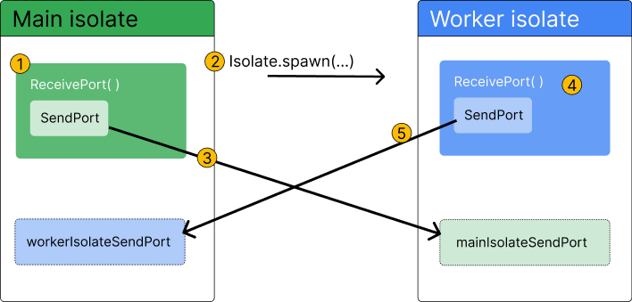
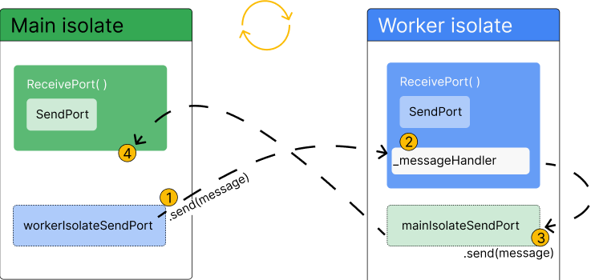

## 基本介绍

- dart 实现异步操作主要包括三种方式：Future、Stream、Isolate

### 1. Future

```dart
Future<void> checkVersion() async {
  var version = await lookUpVersion();
  // Do something with version
}
```

### 2. Stream

- 使用 `await for` 对 stream 进行遍历

```dart
Stream<int> timedCounter(Duration interval, [int maxCount]) async* {
  int i = 0;
  while (true) {
    await Future.delayed(interval);
    yield i++;
    if (i == maxCount) break;
  }
}

```

### 3. Isolate

- 创建 Isolate 有两种方式：
  - `Isolate.run`, 该方法会创建一个新的 Isolate，并在新的 Isolate 中执行指定的函数
  - `Isolate.spawn`, 该方法会创建一个新的 Isolate，该方法适用于要在新的 Isolate 中执行的函数需要多轮交互的情况

#### 3.1 Isolate.run

```dart
// Isolate.run
void main() async {
  // Read some data.
  final jsonData = await Isolate.run(_readAndParseJson);

  // Use that data.
  print('Number of JSON keys: ${jsonData.length}');
}

Future<Map<String, dynamic>> _readAndParseJson() async {
  final fileData = await File(filename).readAsString();
  final jsonData = jsonDecode(fileData) as Map<String, dynamic>;
  return jsonData;
}
```

#### 3.2 Isolate.spawn

- 通过 `ReceivePort` 和 `SendPort` 进行通信





```dart
import 'dart:async';
import 'dart:convert';
import 'dart:isolate';

void main() async {
  final worker = Worker();
  await worker.spawn();
  await worker.parseJson('{"key":"value"}');
}

class Worker {
  late SendPort _sendPort;
  final Completer<void> _isolateReady = Completer.sync();

  Future<void> spawn() async {
    final receivePort = ReceivePort();
    receivePort.listen(_handleResponsesFromIsolate);
    await Isolate.spawn(_startRemoteIsolate, receivePort.sendPort);
  }

  void _handleResponsesFromIsolate(dynamic message) {
    if (message is SendPort) {
      _sendPort = message;
      _isolateReady.complete();
    } else if (message is Map<String, dynamic>) {
      print(message);
    }
  }

  static void _startRemoteIsolate(SendPort port) {
    final receivePort = ReceivePort();
    port.send(receivePort.sendPort);

    receivePort.listen((dynamic message) async {
      if (message is String) {
        final transformed = jsonDecode(message);
        port.send(transformed);
      }
    });
  }

  Future<void> parseJson(String message) async {
    await _isolateReady.future;
    _sendPort.send(message);
  }
}
```
